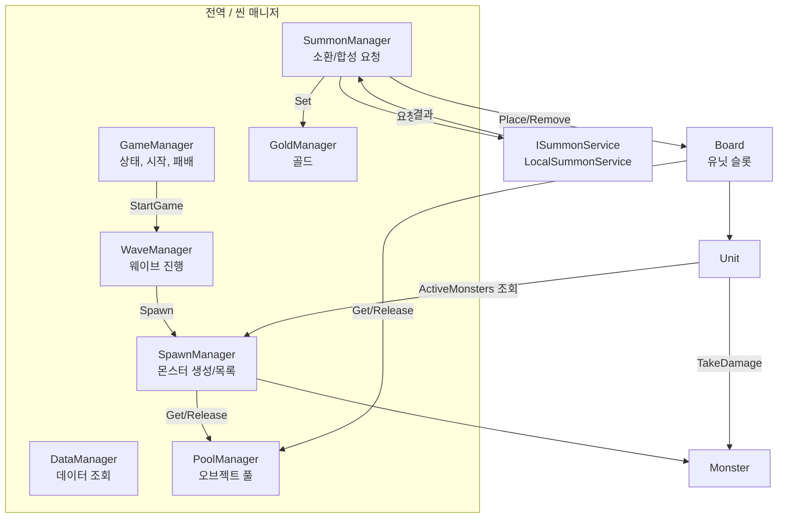
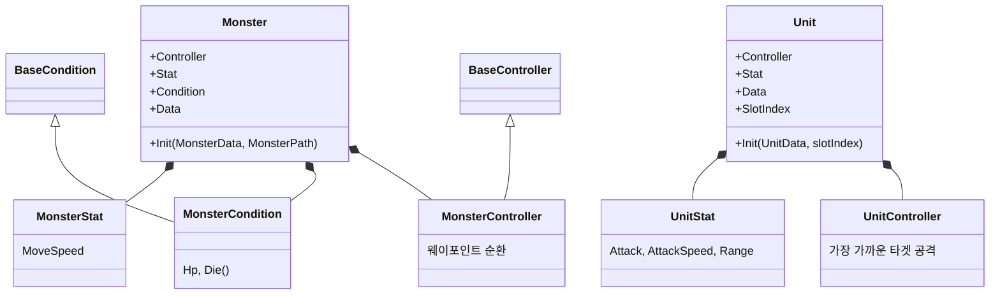
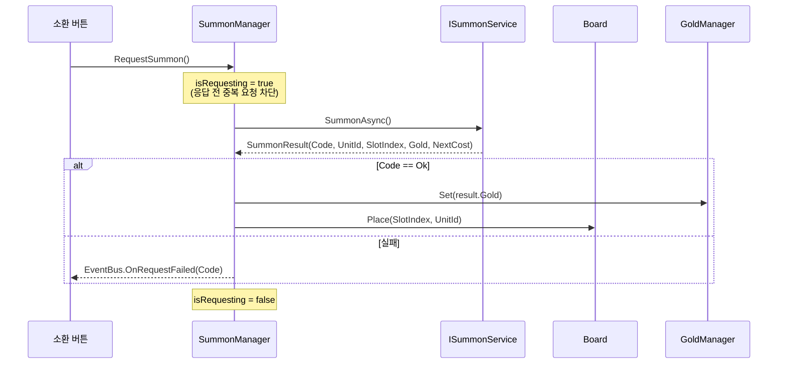
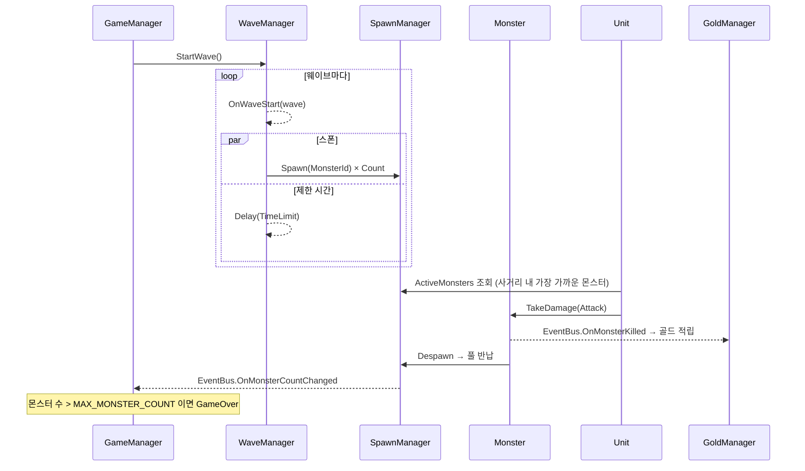

# 클라이언트 아키텍처

Where-Are-You-Looking-At의 구조(허브 + Stat/Condition/Controller 컴포넌트, 싱글톤 매니저, EventBus)를 기반으로 한다.
스크립트 위치는 `Client/Assets/01.Scripts/` 기준이다.

## 1. 전체 구조

## 2. 폴더별 구성

| 폴더 | 클래스 | 역할 |
|---|---|---|
| `00.Common/Attribute` | `Attribute`, `StatAttribute` | 수치 값. 최종값 = (기본 + 가산) × 배율 |
| `00.Common/Condition` | `BaseCondition` | 체력, 데미지, 사망 |
| `00.Common/Controller` | `BaseController` | 이동, Flip, 슬로우 |
| `00.Common` | `Define`, `Enum` | 상수, 열거형 (`GameState`, `Tier`, `AttributeType`, `ErrorCode`) |
| `01.Unit` | `Unit`, `UnitStat`, `UnitController` | 유닛 허브, 스탯, 타겟 탐색과 공격 |
| `02.Summon` | `Board`, `SummonManager`, `ISummonService`, `LocalSummonService` | 보드 슬롯, 소환/합성 요청과 결과 반영 |
| `08.Monster` | `Monster`, `MonsterStat`, `MonsterCondition`, `MonsterController`, `MonsterPath` | 몬스터 허브, 스탯, 체력, 경로 이동 |
| `10.Wave` | `WaveManager` | 웨이브 진행 (UniTask) |
| `99.Manager` | `GameManager`, `DataManager`, `PoolManager`, `SpawnManager`, `GoldManager`, `UIManager`, `EventBus` | 전역 매니저, 이벤트 |
| `*/Data` | `UnitData`, `MonsterData`, `WaveData`, `SummonRateData`, `GameConfigData` | 시트 한 행에 대응하는 데이터 클래스 |

## 3. 엔티티 구조 (허브 + 컴포넌트)

몬스터와 유닛은 허브 클래스 하나가 역할별 컴포넌트를 묶는다. 외부에서는 허브를 통해서만 접근한다.

- **Stat**: `StatAttribute`를 `Dictionary<AttributeType, StatAttribute>`로 관리하고 `Add/Sub/Set/AddMultiplier`로 수정한다.
- **Init**: 풀에서 꺼낼 때마다 데이터로 다시 초기화한다. 이전 상태가 남지 않게 하기 위해서다.
- **풀 키**: `Monster_{Id}`, `Unit_{Id}`. 프리팹은 데이터의 `Prefab` 값과 이름이 같은 것을 찾아 풀을 만든다.

## 4. 소환 / 합성 흐름

소환·합성 결과를 **결정하는 쪽(`ISummonService`)**과 **반영하는 쪽(`SummonManager`)**을 나눴다.
클라이언트는 결과만 받아서 보드와 골드에 반영하므로, 결정하는 쪽을 서버 구현체로 바꿔도 반영 코드는 그대로 쓴다.

| 요청 | 성공 조건 | 실패 코드 |
|---|---|---|
| 소환 | 골드 ≥ 소환 비용, 빈 슬롯 있음 | `NotEnoughGold`, `BoardFull` |
| 합성 | 같은 유닛 `MERGE_REQUIRE_COUNT`개 이상, 다음 등급 유닛 존재 | `InvalidMerge` |

- **소환 비용**: `SUMMON_BASE_COST + SUMMON_COST_INCREASE × 소환 횟수`
- **등급 추첨**: `SummonRate` 확률로 뽑고, 해당 등급 유닛이 없으면 제외한다.
- **합성**: 선택한 슬롯을 포함해 같은 유닛을 재료로 쓰고, 선택한 슬롯에 다음 등급 유닛을 무작위로 배치한다.

## 5. 웨이브 / 전투 흐름

- 웨이브의 스폰과 제한 시간은 동시에 흐른다. 스폰이 끝나도 제한 시간이 지나야 다음 웨이브로 넘어간다.
- `GameOver`가 되면 `WaveManager.StopWave()`로 진행 중인 UniTask를 취소한다.
- 유닛과 몬스터의 `Update`는 `GameState.RUNNING`일 때만 동작한다.

## 6. 이벤트 (EventBus)

| 이벤트 | 발생 시점 | 구독 |
|---|---|---|
| `OnGameStateChanged(GameState)` | 게임 상태 변경 | UI |
| `OnGoldChanged(int)` | 골드 변경 | UI |
| `OnSummonCostChanged(int)` | 소환 비용 변경 | UI |
| `OnWaveStart(int)` | 웨이브 시작 | UI |
| `OnMonsterCountChanged(int)` | 필드 몬스터 수 변경 | GameManager(패배 판정), UI |
| `OnMonsterKilled(Monster)` | 몬스터 처치 | GoldManager |
| `OnRequestFailed(ErrorCode)` | 소환/합성 실패 | UI(토스트) |

구독한 쪽은 `OnDisable`/`OnDestroy`에서 반드시 해제한다.

## 7. 데이터

- 데이터 클래스의 필드 이름은 Google Sheets 1행(필드명)과 같게 유지한다.
- `DataManager`는 지금은 Inspector에 입력한 리스트를 딕셔너리로 만들어 제공한다. (`GetUnit`, `GetMonster`, `UnitTierDict`, `WaveList`, `SummonRateList`)
- 시작 골드, 소환 비용 같은 게임 규칙 값은 `Define`의 상수를 사용한다. (값은 `GameConfig` 시트와 같음)

## 8. 매니저 생명주기

| 매니저 | 범위 |
|---|---|
| `GameManager`, `DataManager`, `PoolManager` | 전역 (`DontDestroyOnLoad`) |
| `SpawnManager`, `WaveManager`, `GoldManager`, `SummonManager`, `UIManager` | 씬마다 하나 |
