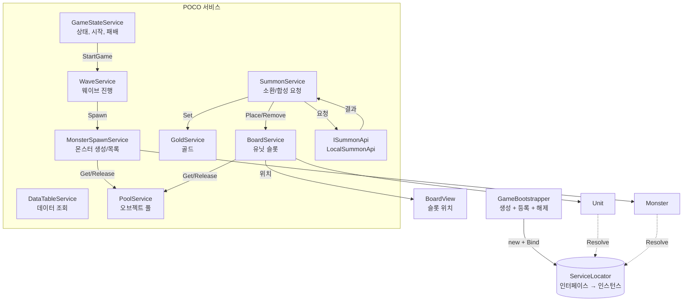
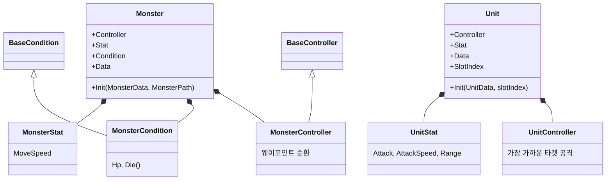
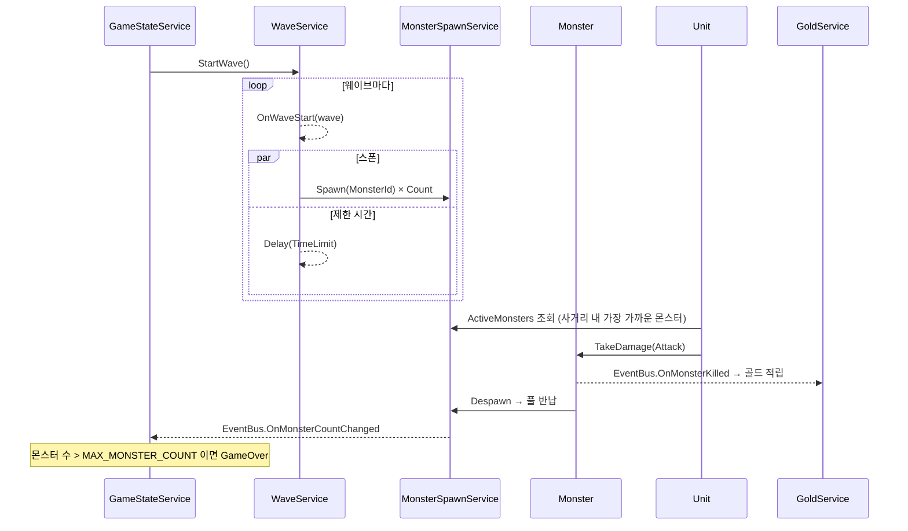

# 클라이언트 아키텍처

로직은 POCO 서비스에, Unity 연결(씬 참조, 렌더링, 물리)은 MonoBehaviour에 둔다.
서비스는 `GameBootstrapper`가 의존 순서대로 생성해 `ServiceLocator`에 인터페이스로 등록하고, 서비스끼리는 생성자로 주입받는다.
몬스터와 유닛은 허브 + Stat/Condition/Controller 컴포넌트 구조를 유지한다.
스크립트 위치는 `Client/Assets/01.Scripts/` 기준이다.

## 1. 전체 구조



실선은 생성자로 주입받은 의존, 점선은 MonoBehaviour가 `Awake`에서 Resolve하는 의존이다.

## 2. 서비스 로케이터와 부트스트래퍼

| 클래스 | 위치 | 역할 |
|---|---|---|
| `ServiceLocator` (static) | `90.Core` | `Dictionary<Type, object>` 저장소. `Bind<T>` / `Resolve<T>` / `TryResolve<T>` / `Clear()` |
| `GameBootstrapper` (MonoBehaviour) | `90.Core` | 씬 진입점. Inspector 참조(데이터, 프리팹, 경로, BoardView)를 받아 서비스를 생성하고 등록 |

### 규칙
- **인터페이스로만 등록한다.** 구체 타입을 Bind하면 예외가 난다. 같은 인터페이스를 두 번 Bind해도 예외가 난다.
- **서비스끼리는 생성자 주입**만 쓴다. `Resolve`는 `GameBootstrapper`와 MonoBehaviour(엔티티, UI)에서만 쓴다. 생성자만 보면 의존이 드러나게 하기 위해서다.
- **생성 순서 = 의존 순서.** 필요한 서비스를 넘기지 않으면 객체를 만들 수 없으므로 순서가 코드로 강제된다.
- 구독이나 CTS를 가진 서비스는 `IDisposable`을 구현한다. `ServiceLocator.Clear()`가 **등록의 역순**으로 Dispose한다.
- 한 인스턴스는 하나의 인터페이스로만 등록한다. (중복 Dispose 방지)
- 플레이 시작 시(`SubsystemRegistration`) 저장소를 비운다. Enter Play Mode에서 도메인 리로드를 꺼도 이전 등록이 남지 않는다.

### 등록 순서
```
DataTable → Pool → Gold → MonsterSpawn → Wave → GameState → Board → SummonApi → Summon
```

### 싱글톤 대신 쓰는 이유
| | 싱글톤 (이전) | 서비스 로케이터 (현재) |
|---|---|---|
| 초기화 순서 | Unity `Awake` 순서에 의존 | Bootstrapper가 코드로 결정 |
| 참조 대상 | 구체 클래스 | 인터페이스 |
| 구현 교체 | 호출부마다 수정 | 등록 한 줄 (`LocalSummonApi` → `ServerSummonApi`) |
| 해제 | 각자 처리 | `Clear()` 한 곳 |
| 테스트 | 씬과 MonoBehaviour 필요 | 가짜 구현을 Bind해 POCO만 검증 |

## 3. 폴더별 구성

| 폴더 | 클래스 | 역할 |
|---|---|---|
| `00.Common/Attribute` | `Attribute`, `StatAttribute` | 수치 값. 최종값 = (기본 + 가산) × 배율 |
| `00.Common/Condition` | `BaseCondition` | 체력, 데미지, 사망 |
| `00.Common/Controller` | `BaseController` | 이동, Flip, 슬로우 |
| `00.Common` | `Define`, `Enum` | 상수, 열거형 (`GameState`, `Tier`, `AttributeType`, `ErrorCode`) |
| `01.Unit` | `Unit`, `UnitStat`, `UnitController` | 유닛 허브, 스탯, 타겟 탐색과 공격 |
| `02.Summon/Board` | `IBoardService`, `BoardService`, `BoardView` | 슬롯 상태와 배치 / 슬롯 위치 |
| `02.Summon/Service` | `ISummonService`, `SummonService`, `ISummonApi`, `LocalSummonApi`, `SummonResult` | 소환/합성 요청과 반영 / 결과 결정 |
| `08.Monster` | `Monster`, `MonsterStat`, `MonsterCondition`, `MonsterController`, `MonsterPath` | 몬스터 허브, 스탯, 체력, 경로 이동 |
| `08.Monster/Service` | `IMonsterSpawnService`, `MonsterSpawnService` | 몬스터 생성/반납, 필드 목록 |
| `10.Wave/Service` | `IWaveService`, `WaveService` | 웨이브 진행 (UniTask) |
| `90.Core` | `ServiceLocator`, `GameBootstrapper` | 서비스 등록과 진입점 |
| `99.Service` | `GameStateService`, `DataTableService`, `PoolService`, `GoldService`, `EventBus` | 게임 전역 서비스, 이벤트 |
| `*/Data` | `UnitData`, `MonsterData`, `WaveData`, `SummonRateData`, `GameConfigData` | 시트 한 행에 대응하는 데이터 클래스 |

### 네이밍
| 역할 | 형태 | 예 |
|---|---|---|
| 로직 (POCO) | `XxxService` + `IXxxService` | `WaveService` |
| 외부 결과 결정 경계 | `XxxApi` + `IXxxApi` | `LocalSummonApi` |
| 씬 참조 전달 (MonoBehaviour) | `XxxView` | `BoardView` |
| UI 화면 / UI 표시 요소 | `XxxHud`·`XxxPopup`·`XxxToast` / `XxxWidget` | 9장 참고 |
| 시트 데이터 | `XxxData` | `UnitData` |

## 4. 엔티티 구조 (허브 + 컴포넌트)

몬스터와 유닛은 허브 클래스 하나가 역할별 컴포넌트를 묶는다. 외부에서는 허브를 통해서만 접근한다.



- **Stat**: `StatAttribute`를 `Dictionary<AttributeType, StatAttribute>`로 관리하고 `Add/Sub/Set/AddMultiplier`로 수정한다.
- **Init**: 풀에서 꺼낼 때마다 데이터로 다시 초기화한다. 이전 상태가 남지 않게 하기 위해서다.
- **서비스 접근**: 엔티티는 생성자 주입을 받을 수 없으므로 `Awake`에서 `ServiceLocator.Resolve`로 받아 캐싱한다. (`IGameStateService`, `IMonsterSpawnService`)
- **풀 키**: `Monster_{Id}`, `Unit_{Id}`. 프리팹은 데이터의 `Prefab` 값과 이름이 같은 것을 찾아 풀을 만든다.

## 5. 소환 / 합성 흐름

소환·합성 결과를 **결정하는 쪽(`ISummonApi`)**과 **반영하는 쪽(`SummonService`)**을 나눴다.
클라이언트는 결과만 받아서 보드와 골드에 반영하므로, 결정하는 쪽을 서버 구현체(`ServerSummonApi`)로 바꿔도 반영 코드는 그대로 쓴다.


| 요청 | 성공 조건 | 실패 코드 |
|---|---|---|
| 소환 | 골드 ≥ 소환 비용, 빈 슬롯 있음 | `NotEnoughGold`, `BoardFull` |
| 합성 | 같은 유닛 `MERGE_REQUIRE_COUNT`개 이상, 다음 등급 유닛 존재 | `InvalidMerge` |

- **소환 비용**: `SUMMON_BASE_COST + SUMMON_COST_INCREASE × 소환 횟수`
- **등급 추첨**: `SummonRate` 확률로 뽑고, 해당 등급 유닛이 없으면 제외한다.
- **합성**: 선택한 슬롯을 포함해 같은 유닛을 재료로 쓰고, 선택한 슬롯에 다음 등급 유닛을 무작위로 배치한다.
- **취소**: 진행 중인 요청은 `SummonService.Dispose()`(씬 종료)에서 취소된다.

## 6. 웨이브 / 전투 흐름



- 웨이브의 스폰과 제한 시간은 동시에 흐른다. 스폰이 끝나도 제한 시간이 지나야 다음 웨이브로 넘어간다.
- `GameOver`가 되면 `WaveService.StopWave()`로 진행 중인 UniTask를 취소한다. 씬 종료 시에는 `Dispose()`가 같은 처리를 한다.
- 유닛과 몬스터의 `Update`는 `GameState.RUNNING`일 때만 동작한다.
- 매 프레임 도는 코드에서는 `IReadOnlyList`를 `foreach`하지 않고 인덱스로 순회한다. (열거자 박싱으로 인한 GC 방지)

## 7. 이벤트 (EventBus)

| 이벤트 | 발생 시점 | 구독 |
|---|---|---|
| `OnGameStateChanged(GameState)` | 게임 상태 변경 | UI |
| `OnGoldChanged(int)` | 골드 변경 | UI |
| `OnSummonCostChanged(int)` | 소환 비용 변경 | UI |
| `OnWaveStart(int)` | 웨이브 시작 | UI |
| `OnMonsterCountChanged(int)` | 필드 몬스터 수 변경 | GameStateService(패배 판정), UI |
| `OnMonsterKilled(Monster)` | 몬스터 처치 | GoldService |
| `OnRequestFailed(ErrorCode)` | 소환/합성 실패 | UI(토스트) |

- 서비스는 생성자에서 구독하고 `Dispose`에서 해제한다.
- MonoBehaviour는 `OnEnable`/`OnDisable` 또는 `OnDestroy`에서 해제한다.

## 8. 데이터

- 데이터 클래스의 필드 이름은 Google Sheets 1행(필드명)과 같게 유지한다.
- `DataTableService`는 지금은 `GameBootstrapper` Inspector에 입력한 리스트를 딕셔너리로 만들어 제공한다. (`GetUnit`, `GetMonster`, `UnitTierDict`, `WaveList`, `SummonRateList`)
- 시작 골드, 소환 비용 같은 게임 규칙 값은 `Define`의 상수를 사용한다. (값은 `GameConfig` 시트와 같음)

## 9. UI 구조 (설계 결정, 구현 예정)

UI는 **서비스를 호출하고 결과만 표시한다.** 상태 변경과 실패 처리 판단은 서비스가 하고, UI는 이벤트를 구독해 갱신한다.
화면이 적은 캐주얼 게임이라 화면 단위(Screen)와 표시 요소(Widget) 두 층만 둔다.

```
UIScreen (기본 클래스: Open / Close / SetData 생명주기, 서비스 Resolve, 이벤트 구독/해제)
 ├ UIHud    → GameHud            항상 떠 있는 화면
 ├ UIPopup  → GameOverPopup      위에 열리고 닫히는 화면
 └ UIToast  → RequestFailedToast 잠깐 뜨는 알림
XxxWidget  → GoldWidget, WaveWidget  받은 값만 표시하는 재사용 요소
```

| 구성 | 역할 |
|---|---|
| `IUIService` / `UIService` | `OpenAsync<T>(data)` / `Close<T>()`, 열린 화면 관리, 레이어 정렬 (Hud < Popup < Toast) |
| `UIConfig` (SO) | Screen 타입 → 프리팹. Addressables 도입 시 주소로 교체 |

- `View`는 씬 참조 전달용(`BoardView`)으로만 쓰고 UI에는 쓰지 않는다.
